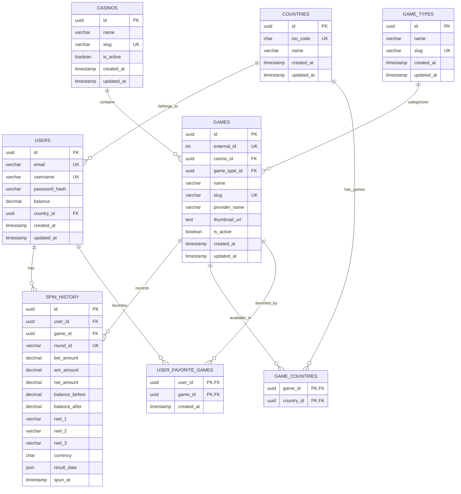

# Database Schema

This document describes the relational database design for the casino game platform.

The database is normalized and designed around users, casinos, games, game types, countries, favorite games, and permanent spin history.

## Entities

- Users
- Casinos
- Games
- Game Types
- Countries
- Game Countries
- User Favorite Games
- Spin History

## ER Diagram



## Relationships

- A casino contains multiple games.
- Each game belongs to one game type.
- A game can be available in multiple countries.
- A user belongs to one country optionally.
- A user can favorite multiple games.
- A game can be favorited by multiple users.
- Every spin is permanently stored in spin history.
- A spin belongs to one user.
- A spin can optionally be linked to a game.

## SQL CREATE TABLE Statements

```sql
CREATE EXTENSION IF NOT EXISTS pgcrypto;
CREATE EXTENSION IF NOT EXISTS pg_trgm;

CREATE TABLE casinos (
  id UUID PRIMARY KEY DEFAULT gen_random_uuid(),
  name VARCHAR(100) NOT NULL,
  slug VARCHAR(120) NOT NULL UNIQUE,
  is_active BOOLEAN NOT NULL DEFAULT true,
  created_at TIMESTAMPTZ NOT NULL DEFAULT now(),
  updated_at TIMESTAMPTZ NOT NULL DEFAULT now()
);

CREATE TABLE game_types (
  id UUID PRIMARY KEY DEFAULT gen_random_uuid(),
  name VARCHAR(100) NOT NULL,
  slug VARCHAR(120) NOT NULL UNIQUE,
  created_at TIMESTAMPTZ NOT NULL DEFAULT now(),
  updated_at TIMESTAMPTZ NOT NULL DEFAULT now()
);

CREATE TABLE countries (
  id UUID PRIMARY KEY DEFAULT gen_random_uuid(),
  iso_code CHAR(2) NOT NULL UNIQUE,
  name VARCHAR(100) NOT NULL,
  created_at TIMESTAMPTZ NOT NULL DEFAULT now(),
  updated_at TIMESTAMPTZ NOT NULL DEFAULT now()
);

CREATE TABLE users (
  id UUID PRIMARY KEY DEFAULT gen_random_uuid(),
  email VARCHAR(255) NOT NULL UNIQUE,
  username VARCHAR(50) NOT NULL UNIQUE,
  password_hash VARCHAR(255) NOT NULL,
  balance DECIMAL(18, 2) NOT NULL DEFAULT 20.00,
  country_id UUID NULL,
  created_at TIMESTAMPTZ NOT NULL DEFAULT now(),
  updated_at TIMESTAMPTZ NOT NULL DEFAULT now(),

  CONSTRAINT fk_users_country
    FOREIGN KEY (country_id)
    REFERENCES countries(id)
    ON DELETE SET NULL
    ON UPDATE CASCADE,

  CONSTRAINT chk_users_balance_non_negative
    CHECK (balance >= 0)
);

CREATE TABLE games (
  id UUID PRIMARY KEY DEFAULT gen_random_uuid(),
  external_id INT NOT NULL UNIQUE,
  casino_id UUID NOT NULL,
  game_type_id UUID NOT NULL,
  name VARCHAR(150) NOT NULL,
  slug VARCHAR(180) NOT NULL UNIQUE,
  provider_name VARCHAR(100) NOT NULL,
  thumbnail_url TEXT NULL,
  is_active BOOLEAN NOT NULL DEFAULT true,
  created_at TIMESTAMPTZ NOT NULL DEFAULT now(),
  updated_at TIMESTAMPTZ NOT NULL DEFAULT now(),

  CONSTRAINT fk_games_casino
    FOREIGN KEY (casino_id)
    REFERENCES casinos(id)
    ON DELETE RESTRICT
    ON UPDATE CASCADE,

  CONSTRAINT fk_games_game_type
    FOREIGN KEY (game_type_id)
    REFERENCES game_types(id)
    ON DELETE RESTRICT
    ON UPDATE CASCADE
);

CREATE TABLE game_countries (
  game_id UUID NOT NULL,
  country_id UUID NOT NULL,

  PRIMARY KEY (game_id, country_id),

  CONSTRAINT fk_game_countries_game
    FOREIGN KEY (game_id)
    REFERENCES games(id)
    ON DELETE CASCADE
    ON UPDATE CASCADE,

  CONSTRAINT fk_game_countries_country
    FOREIGN KEY (country_id)
    REFERENCES countries(id)
    ON DELETE CASCADE
    ON UPDATE CASCADE
);

CREATE TABLE user_favorite_games (
  user_id UUID NOT NULL,
  game_id UUID NOT NULL,
  created_at TIMESTAMPTZ NOT NULL DEFAULT now(),

  PRIMARY KEY (user_id, game_id),

  CONSTRAINT fk_user_favorite_games_user
    FOREIGN KEY (user_id)
    REFERENCES users(id)
    ON DELETE CASCADE
    ON UPDATE CASCADE,

  CONSTRAINT fk_user_favorite_games_game
    FOREIGN KEY (game_id)
    REFERENCES games(id)
    ON DELETE CASCADE
    ON UPDATE CASCADE
);

CREATE TABLE spin_history (
  id UUID PRIMARY KEY DEFAULT gen_random_uuid(),
  user_id UUID NOT NULL,
  game_id UUID NULL,
  round_id VARCHAR(150) NOT NULL UNIQUE,

  bet_amount DECIMAL(18, 2) NOT NULL,
  win_amount DECIMAL(18, 2) NOT NULL DEFAULT 0.00,
  net_amount DECIMAL(18, 2) NOT NULL DEFAULT 0.00,
  balance_before DECIMAL(18, 2) NOT NULL,
  balance_after DECIMAL(18, 2) NOT NULL,

  reel_1 VARCHAR(50) NOT NULL,
  reel_2 VARCHAR(50) NOT NULL,
  reel_3 VARCHAR(50) NOT NULL,

  currency CHAR(3) NOT NULL DEFAULT 'COI',
  result_data JSONB NULL,
  spun_at TIMESTAMPTZ NOT NULL DEFAULT now(),

  CONSTRAINT fk_spin_history_user
    FOREIGN KEY (user_id)
    REFERENCES users(id)
    ON DELETE RESTRICT
    ON UPDATE CASCADE,

  CONSTRAINT fk_spin_history_game
    FOREIGN KEY (game_id)
    REFERENCES games(id)
    ON DELETE SET NULL
    ON UPDATE CASCADE,

  CONSTRAINT chk_spin_history_bet_amount_range
    CHECK (bet_amount >= 0.50 AND bet_amount <= 5.00),

  CONSTRAINT chk_spin_history_win_amount_non_negative
    CHECK (win_amount >= 0),

  CONSTRAINT chk_spin_history_balance_before_non_negative
    CHECK (balance_before >= 0),

  CONSTRAINT chk_spin_history_balance_after_non_negative
    CHECK (balance_after >= 0),

  CONSTRAINT chk_spin_history_reel_1_symbol
    CHECK (reel_1 IN ('cherry', 'lemon', 'apple', 'banana')),

  CONSTRAINT chk_spin_history_reel_2_symbol
    CHECK (reel_2 IN ('cherry', 'lemon', 'apple', 'banana')),

  CONSTRAINT chk_spin_history_reel_3_symbol
    CHECK (reel_3 IN ('cherry', 'lemon', 'apple', 'banana'))
);
```

## Indexes

```sql
CREATE INDEX idx_games_casino_id ON games(casino_id);
CREATE INDEX idx_games_game_type_id ON games(game_type_id);
CREATE INDEX idx_games_is_active ON games(is_active);
CREATE INDEX idx_games_provider_name ON games(provider_name);
CREATE INDEX idx_games_created_at ON games(created_at DESC);

CREATE INDEX idx_game_countries_country_id ON game_countries(country_id);

CREATE INDEX idx_user_favorite_games_game_id ON user_favorite_games(game_id);

CREATE INDEX idx_spin_history_user_id ON spin_history(user_id);
CREATE INDEX idx_spin_history_game_id ON spin_history(game_id);
CREATE INDEX idx_spin_history_user_spun_at ON spin_history(user_id, spun_at DESC);
CREATE INDEX idx_spin_history_game_spun_at ON spin_history(game_id, spun_at DESC);
CREATE INDEX idx_spin_history_spun_at ON spin_history(spun_at DESC);

CREATE INDEX idx_games_name_trgm
ON games USING GIN (name gin_trgm_ops);

CREATE INDEX idx_games_slug_trgm
ON games USING GIN (slug gin_trgm_ops);

CREATE INDEX idx_games_provider_name_trgm
ON games USING GIN (provider_name gin_trgm_ops);

CREATE INDEX idx_games_active_created_at
ON games (is_active, created_at DESC);

CREATE INDEX idx_games_active_provider_name
ON games (is_active, provider_name);
```

## Notes

The SQL above represents the intended relational schema. The actual database is managed through Prisma migrations in the backend project.